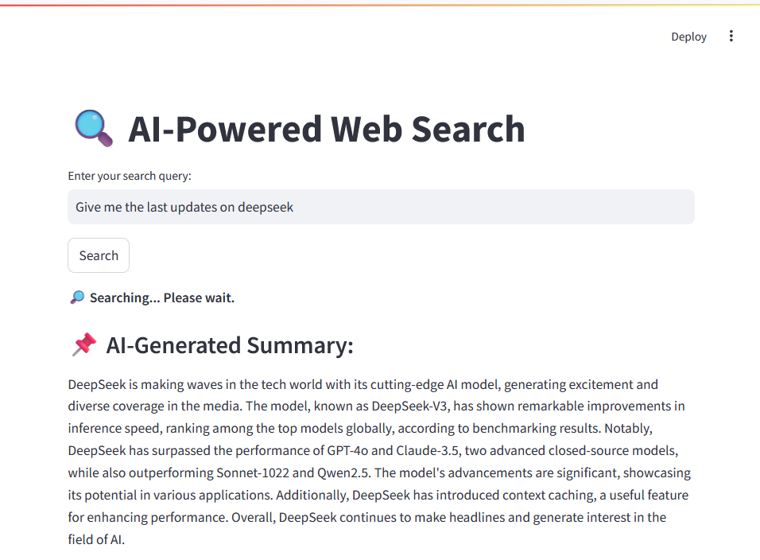

# WebSearch Demo (AI Agent + Streamlit)


Includes:
- Web Search tool (DuckDuckGo)
- Steamlit search UI

## Environment variables setup:
- Create the .env file that contains the following variables:
```bash
AWS_ACCESS_KEY_ID= "access_key"
AWS_SECRET_ACCESS_KEY= "secert_access_key"
AWS_REGION= "region"
```
- Load them via the following code:
```python
from dotenv import load_dotenv

load_dotenv()                   # Loading API key from .env file
```
## Demo


## Getting Started

#### 1. Clone and Install

```bash
# Clone the repo

git clone https://github.com/salehafzoon/AI-Agent-Development.git   
```
